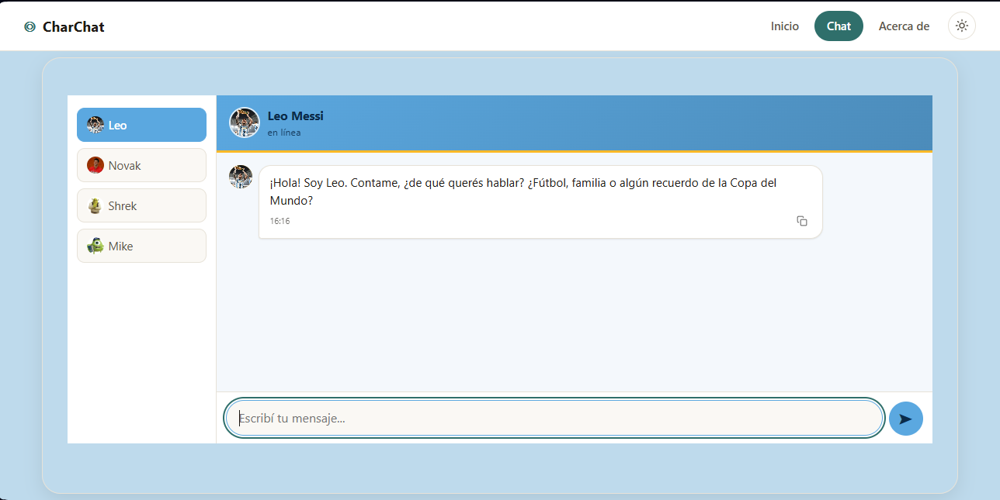
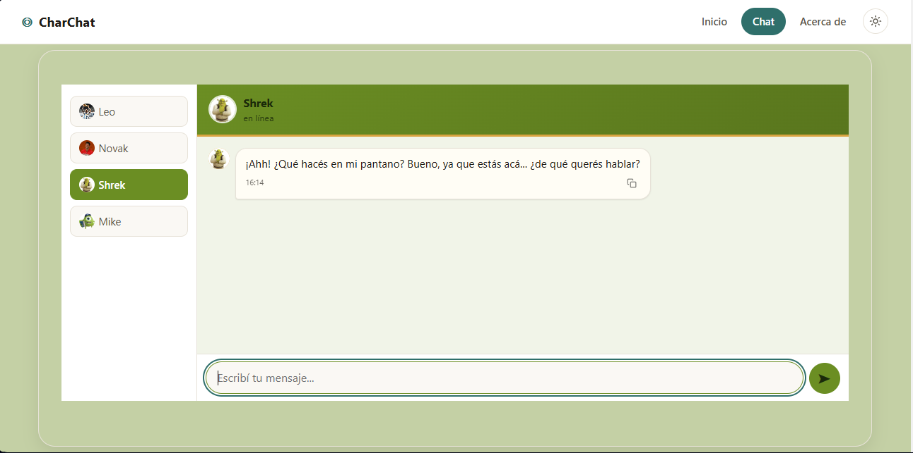
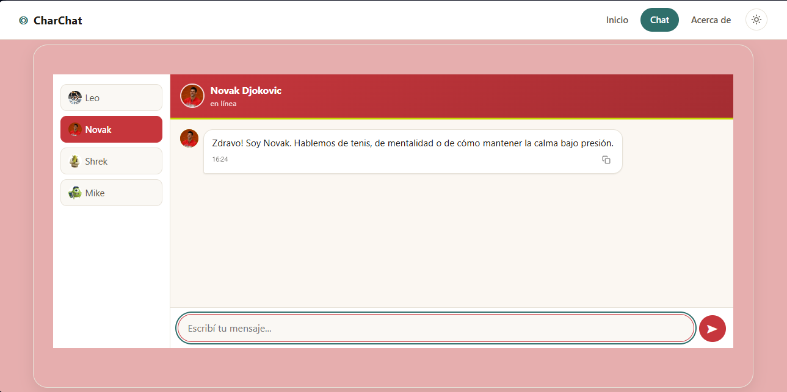
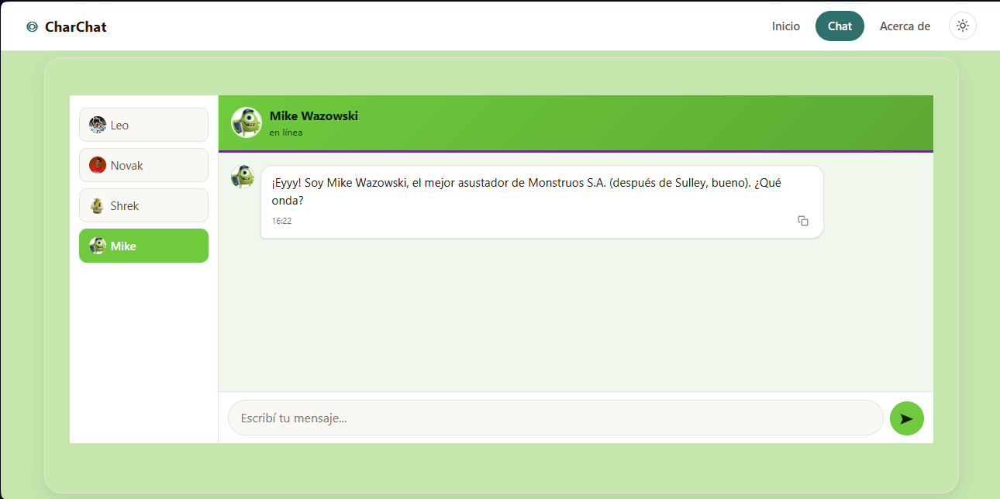
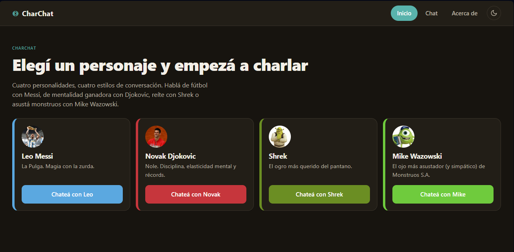

# CharChat

SPA de chat conversacional con personajes impulsada por la API de Google Gemini.

## Personajes

| Personaje | Descripción | Temperatura |
|-----------|------------|:---:|
| **Leo Messi** | La Pulga. Capitán de la Selección Argentina, campeón del mundo y ocho veces Balón de Oro. Habla con calma, humildad y pasión por el fútbol de potrero. | 0.7 |
| **Novak Djokovic** | Nole. Máximo ganador de Grand Slams en la historia del tenis masculino. Filosófico, meticuloso y obsesionado con la mejora constante. | 0.3 |
| **Shrek** | El ogro más querido del pantano. Sarcástico, directo y con un cariño especial por las cebollas. Gruñón pero de buen corazón. | 0.5 |
| **Mike Wazowski** | El ojo más asustador (y simpático) de Monstruos S.A. Optimista, gracioso y siempre con un chiste a mano. | 0.9 |

Cada personaje respeta su personalidad, tono y estilo gracias a un *system prompt* construido en el backend. La temperatura controla cuán predecible (baja) o creativa (alta) es cada respuesta.

## Stack

- **Frontend:** HTML, CSS, JavaScript vanilla (SPA con router propio)
- **Backend:** API Serverless (Vercel Functions) con `@google/genai`
- **Tests:** Vitest
- **Deploy:** Vercel

## Requisitos

- Node.js 18+
- Una API Key de [Google AI Studio](https://aistudio.google.com/apikey)

## Ejecutar local

### 1. Clonar e instalar

```bash
git clone https://github.com/tongax12/ProyectoM3_GastonStratta.git
cd ProyectoM3_GastonStratta
npm install
```

### 2. Variables de entorno

Crear un archivo `.env` en la raíz:

```
GEMINI_API_KEY=tu_api_key
```

### 3. Levantar el frontend

```bash
npm run dev
```

Abre `http://localhost:3000`. Sirve los archivos estáticos de `src/` con fallback a `index.html` para el ruteo del lado del cliente.

### 4. Levantar las API functions (opcional, para chat real)

```bash
npm run dev:api
```

Esto inicia `vercel dev` en el puerto 3001 (o el que Vercel asigne). Si usás solo `npm run dev` el chat mostrará respuestas simuladas (mock).

## Ejecutar tests

```bash
npm test
```

34 tests en 7 archivos que cubren: characters, errors, fetchApi, functions (API handler), gemini (utils), normalize y response (utils).

```bash
npm run test:watch
```

Para modo *watch* durante desarrollo.

## Desplegar a Vercel

Conectá el repositorio en [vercel.com](https://vercel.com) o usá la CLI:

```bash
npx vercel --prod
```

El archivo `vercel.json` ya está configurado para:
- Servir `src/` como directorio de salida
- Redirigir todas las rutas a `index.html` (SPA)
- Mantener las rutas `/api/*` para las serverless functions

Acordate de agregar `GEMINI_API_KEY` como variable de entorno en Vercel (Settings → Environment Variables).

## Capturas de pantalla

<!-- Agregar capturas de pantalla acá -->
| Vista | Captura |
|-------|---------|
| Home |  |
| Chat con Messi |  |
| Chat con Shrek |  |
| Chat con Novak |  |
| Chat con Mike |  |
| Modo oscuro |  |

## Estructura del Proyecto
ProyectoM3_GastonStratta/
├── api/
│   └── functions.js              # API serverless — handler del chat con Gemini
├── docs/
│   └── prompt-IA.md              # Registro de prompts usados con IA
├── src/                          # Frontend SPA
│   ├── css/
│   │   └── styles.css            # Estilos globales + themes claro/oscuro
│   ├── img/                      # Imágenes (avatares + capturas)
│   │   ├── messi.jpg, djokovic.jpg, shrek.jpg, mike.jpg
│   │   └── home.png, chat-messi.png, chat-novak.png, chat-shrek.png,
│   │       chat-mike.png, dark-theme.png
│   ├── services/
│   │   └── fetchApi.js           # Llamadas a la API desde el frontend
│   ├── utils/
│   │   ├── errors.js             # Utilidades de manejo de errores
│   │   ├── gemini.js             # Transformación de mensajes a formato Gemini
│   │   ├── request.js            # Parseo de body / mensajes
│   │   └── response.js           # Formateo de respuestas del chat
│   ├── views/
│   │   ├── home.js               # Vista Home
│   │   ├── chat.js               # Vista Chat
│   │   ├── about.js              # Vista Acerca de
│   │   └── notFound.js           # Vista 404
│   ├── characters.js             # Catálogo de personajes
│   ├── index.html                # Entry point HTML
│   ├── main.js                   # Bootstrap de la app
│   ├── navigation.js             # Navegación (header + tab-bar)
│   ├── normalize.js              # CSS reset / normalización
│   ├── router.js                 # Router SPA casero
│   ├── theme.js                  # Toggle de tema claro/oscuro
│   └── theme-init.js             # Tema sincrónico anti-flash
├── tests/
│   ├── characters.test.js        # 4 tests — personajes
│   ├── errors.test.js            # 7 tests — utilidades de error
│   ├── fetchApi.test.js          # 4 tests — fetchApi (mock de fetch)
│   ├── functions.test.js         # 5 tests — API handler (mock de Gemini)
│   ├── gemini.test.js            # 4 tests — transformación Gemini
│   ├── normalize.test.js         # 6 tests — normalización de texto
│   └── response.test.js          # 4 tests — formateo de respuestas
├── .env                          # Variables de entorno (local, no commiteado)
├── .env.example                  # Template de .env
├── .env.local                    # Variables para Vercel dev (no commiteado)
├── .vercel/                      # Config local de Vercel
├── .vscode/
│   └── settings.json
├── package.json
├── package-lock.json
├── README.md
└── vercel.json

## Deploy

🔗 **Demo en vivo:** [Proyecto desplegado](https://proyecto-m3-gaston-stratta.vercel.app)


## Uso de IA

Este proyecto utilizó asistentes de IA (específicamente Claude de Anthropic y Gemini de Google) como apoyo durante el desarrollo:

- **Claude (opencode):** usado como asistente de codificación interactivo durante la mayor parte del desarrollo del frontend, tests y configuración del proyecto.
- **Gemini API:** motor de respuestas del chat, consumida desde el backend serverless.

Interacciones con la IA aqui: [Ver prompts usados en la IA](./docs/prompt-IA.md)

Las decisiones de diseño, arquitectura y correcciones fueron validadas manualmente.
